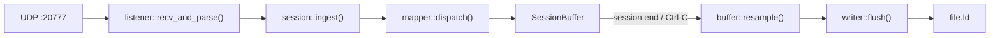

# Design Document

## Overview

Graffiti is a Rust CLI tool that bridges F1 24's UDP telemetry broadcast with MoTeC i2 professional data analysis software. It listens on UDP port 20777, parses incoming F1 24 packets, buffers timestamped telemetry samples per session, and on session end (or Ctrl-C) resamples the data to uniform time grids and writes MoTeC i2-compatible `.ld` binary files.

The architecture is a single-threaded event loop with clearly separated modules for listening, session management, channel mapping, buffering, resampling, and file writing. Two key external crates handle the complex binary formats: `f1-game-packet-parser` for UDP packet deserialization and `motec-i2` for LD file generation.

**Key design rationale:**
- Single-threaded: F1 24 sends at ~60 Hz max; a single thread can easily keep up while avoiding synchronization complexity.
- Buffer-then-flush: Store raw `TimedSample` values during the session and resample at flush time. This simplifies flashback handling (just truncate the buffer) and avoids streaming write complexity.
- Zero-order hold resampling: The simplest interpolation that preserves the last known value, appropriate for telemetry where values change discretely between packets.

## Architecture

```
graffiti/
├── Cargo.toml
└── src/
    ├── main.rs        — UDP socket, main loop, Ctrl-C shutdown
    ├── listener.rs    — recv bytes → parse() → typed F1 packets
    ├── session.rs     — SessionState machine (Idle ↔ Active), file naming
    ├── buffer.rs      — SessionBuffer + TimedSample + resampling
    ├── channels.rs    — ChannelId enum + ChannelMetadata catalog (36 channels)
    ├── mapper.rs      — dispatch(F1Packet) → buffer.push() per channel
    └── writer.rs      — flush(SessionBuffer) → motec-i2 LDWriter → .ld file
```

### Data Flow



### Main Loop Pseudocode

```
fn main():
    bind UDP socket on 0.0.0.0:20777
    install Ctrl-C handler (sets atomic shutdown flag)
    let session_state = Idle
    
    loop:
        if shutdown_flag.load():
            if session_state == Active:
                flush_session()
            break
        
        recv datagram (with timeout for shutdown check)
        packet = parse(datagram) or { log warning; continue }
        
        match session_state:
            Idle:
                if packet.session_uid != 0:
                    session_state = Active(new SessionBuffer)
                    log session start
            Active(buffer):
                if packet.session_uid == 0:
                    flush_session(buffer)
                    session_state = Idle
                elif packet.session_uid != buffer.session_uid:
                    flush_session(buffer)
                    session_state = Active(new SessionBuffer)
                elif packet is Flashback event:
                    buffer.truncate_after(flashback_session_time)
                else:
                    mapper::dispatch(packet, buffer)
```

## Components and Interfaces

### listener.rs

```rust
/// Receives a single UDP datagram and parses it into a typed F1 packet.
/// Returns None if the datagram is malformed (logs a warning).
pub fn recv_and_parse(socket: &UdpSocket, buf: &mut [u8; 2048]) -> Option<F1Packet>;
```

**Responsibilities:**
- Bind and receive from UDP socket
- Delegate parsing to `f1-game-packet-parser`
- Extract `session_uid`, `session_time`, and `player_car_index` from packet header
- Return a unified `F1Packet` enum wrapping the parsed packet type

### session.rs

```rust
pub enum SessionState {
    Idle,
    Active {
        session_uid: u64,
        buffer: SessionBuffer,
        start_time: chrono::DateTime<chrono::Local>,
        track_name: Option<String>,
        session_type: Option<String>,
    },
}

impl SessionState {
    /// Process an incoming packet's session_uid. Returns a FlushRequest
    /// if a session transition occurred.
    pub fn ingest(&mut self, session_uid: u64, packet: &F1Packet) -> Option<FlushRequest>;
}

pub struct FlushRequest {
    pub buffer: SessionBuffer,
    pub session_uid: u64,
    pub start_time: chrono::DateTime<chrono::Local>,
    pub track_name: Option<String>,
    pub session_type: Option<String>,
}

/// Generate output filename: {YYYYMMDD}_{HHMMSS}_{session_uid}.ld
pub fn generate_filename(start_time: &chrono::DateTime<chrono::Local>, session_uid: u64) -> String;
```

**Responsibilities:**
- Track Idle ↔ Active state transitions based on `session_uid`
- Trigger flush on session change, shutdown, or zero-uid transition
- Generate descriptive filenames from session metadata

### buffer.rs

```rust
#[derive(Clone, Copy)]
pub struct TimedSample {
    pub session_time: f32,
    pub value: f32,
}

pub struct ChannelBuffer {
    pub samples: Vec<TimedSample>,
}

pub struct SessionBuffer {
    pub session_uid: u64,
    pub channels: HashMap<ChannelId, ChannelBuffer>,
}

impl SessionBuffer {
    pub fn new(session_uid: u64) -> Self;
    
    /// Push a sample to the specified channel buffer.
    pub fn push(&mut self, channel: ChannelId, sample: TimedSample);
    
    /// Truncate all channel buffers, discarding samples with
    /// session_time > flashback_time.
    pub fn truncate_after(&mut self, flashback_time: f32);
    
    /// Total number of samples across all channels.
    pub fn total_samples(&self) -> usize;
}

/// Resample a channel's raw samples to a uniform time grid using zero-order hold.
/// Returns a Vec<f32> of uniformly spaced values.
pub fn resample_channel(
    samples: &[TimedSample],
    sample_rate_hz: u32,
    end_time: f32,
) -> Vec<f32>;
```

**Responsibilities:**
- Store raw `TimedSample` values per channel
- Maintain ascending `session_time` order within each channel
- Implement flashback truncation
- Resample irregular samples to uniform grids at flush time

### channels.rs

```rust
#[derive(Debug, Clone, Copy, PartialEq, Eq, Hash)]
pub enum ChannelId {
    Speed,
    Throttle,
    Brake,
    Steering,
    Gear,
    EngineRpm,
    EngineTemp,
    DrsEnabled,
    Clutch,
    GForceLateral,
    GForceLongitudinal,
    GForceVertical,
    WorldPosX,
    WorldPosY,
    WorldPosZ,
    LapDistance,
    CurrentLap,
    BrakeTempFL, BrakeTempFR, BrakeTempRL, BrakeTempRR,
    TyreSurfTempFL, TyreSurfTempFR, TyreSurfTempRL, TyreSurfTempRR,
    TyreInnerTempFL, TyreInnerTempFR, TyreInnerTempRL, TyreInnerTempRR,
    TyrePressureFL, TyrePressureFR, TyrePressureRL, TyrePressureRR,
    FuelInTank,
    FuelRemainingLaps,
    ErsStoreEnergy,
}

#[derive(Debug, Clone, Copy)]
pub enum DataType {
    I16,
    I32,
    F32,
}

#[derive(Debug, Clone)]
pub struct ChannelMeta {
    pub id: ChannelId,
    pub name: &'static str,       // max 32 bytes
    pub short_name: &'static str, // max 8 bytes
    pub unit: &'static str,
    pub sample_rate_hz: u32,      // 50, 20, or 2
    pub data_type: DataType,
}

/// Returns the full catalog of 36 channel metadata entries.
pub fn catalog() -> &'static [ChannelMeta; 36];

/// Returns metadata for a specific channel.
pub fn meta_for(id: ChannelId) -> &'static ChannelMeta;
```

**Responsibilities:**
- Define the complete 36-channel catalog with names, units, rates, and types
- Enforce LD format string length constraints (32-byte name, 8-byte short_name)
- Provide lookup by `ChannelId`

### mapper.rs

```rust
/// Dispatch a parsed F1 packet to the session buffer, extracting
/// telemetry values for the player car and pushing TimedSamples.
pub fn dispatch(packet: &F1Packet, player_car_index: u8, session_time: f32, buffer: &mut SessionBuffer);
```

**Responsibilities:**
- Extract per-car data using `player_car_index`
- Convert throttle/brake from 0.0–1.0 to 0–100 percentage
- Map packet fields to the correct `ChannelId`
- Push `TimedSample { session_time, value }` to the buffer

### writer.rs

```rust
/// Flush a session buffer to an LD file.
/// Resamples all channels, constructs motec-i2 channel metadata,
/// and writes the binary LD file.
pub fn flush(
    buffer: &SessionBuffer,
    output_dir: &Path,
    filename: &str,
    metadata: &SessionMetadata,
) -> anyhow::Result<PathBuf>;

pub struct SessionMetadata {
    pub event_name: String,
    pub session_type: String,
    pub start_time: chrono::DateTime<chrono::Local>,
}
```

**Responsibilities:**
- Determine the global end time across all channels
- Resample each channel to its declared sample rate
- Construct `motec_i2::ChannelMetadata` (set `prev_addr`, `next_addr`, `data_addr`, `data_count` to 0; `LDWriter.write()` fills them)
- Convert resampled `f32` values to the channel's declared `DataType` (I16, I32, or F32)
- Handle file naming collisions with numeric suffix `_N`
- Create output directory if it doesn't exist

## Data Models

### TimedSample

```rust
#[derive(Clone, Copy, Debug)]
pub struct TimedSample {
    pub session_time: f32,  // seconds since session start
    pub value: f32,         // telemetry value (may be cast to I16/I32 at write time)
}
```

All telemetry values are stored as `f32` during buffering regardless of their final LD data type. Type conversion happens at write time to keep the buffer uniform and simple.

### SessionBuffer

```rust
pub struct SessionBuffer {
    pub session_uid: u64,
    pub channels: HashMap<ChannelId, ChannelBuffer>,
}

pub struct ChannelBuffer {
    pub samples: Vec<TimedSample>,
}
```

**Memory estimate:** For a 2-hour race at 50 Hz × 36 channels:
- 50 Hz channels (17): 17 × 7200s × 50 = 6,120,000 samples
- 20 Hz channels (16): 16 × 7200s × 20 = 2,304,000 samples  
- 2 Hz channels (3): 3 × 7200s × 2 = 43,200 samples
- Total: ~8,467,200 samples × 8 bytes (f32 + f32) = ~64 MB raw
- After resampling: similar magnitude in output vectors
- Acceptable for a desktop application; no streaming write needed.

### ChannelMeta (Static Catalog)

| Group | Channels | Hz | Type |
|-------|----------|----|------|
| Motion/Telemetry | Speed, Throttle, Brake, Steering, Gear, RPM, DRS, Clutch, G-forces (3), World Pos (3), Lap Distance, Current Lap | 50 | F32/I16 |
| Temperatures/Pressures | Brake Temp (4), Tyre Surf Temp (4), Tyre Inner Temp (4), Tyre Pressure (4) | 20 | I16/F32 |
| Fuel/ERS | Fuel Mass, Fuel Remaining Laps, ERS Store Energy | 2 | F32 |

### Resampling Algorithm (Zero-Order Hold)

```
fn resample_channel(samples: &[TimedSample], rate_hz: u32, end_time: f32) -> Vec<f32>:
    let dt = 1.0 / rate_hz as f32
    let num_points = ceil(end_time / dt) as usize + 1
    let mut output = vec![0.0; num_points]
    let mut sample_idx = 0
    let mut current_value = 0.0  // default before first sample
    
    for i in 0..num_points:
        let t = i as f32 * dt
        // Advance sample_idx to the last sample at or before t
        while sample_idx < samples.len() && samples[sample_idx].session_time <= t:
            current_value = samples[sample_idx].value
            sample_idx += 1
        output[i] = current_value
    
    output
```

### LD File Structure (motec-i2 crate)

The `motec-i2` crate handles the binary format. Key integration points:

```rust
// Construct channel metadata for motec-i2
let channel_meta = motec_i2::ChannelMetadata {
    prev_addr: 0,       // filled by LDWriter
    next_addr: 0,       // filled by LDWriter
    data_addr: 0,       // filled by LDWriter
    data_count: 0,      // filled by LDWriter
    name: truncate_to_32(meta.name),
    short_name: truncate_to_8(meta.short_name),
    unit: meta.unit.to_string(),
    sample_rate: meta.sample_rate_hz,
    data_type: match meta.data_type {
        DataType::I16 => motec_i2::DataType::I16,
        DataType::I32 => motec_i2::DataType::I32,
        DataType::F32 => motec_i2::DataType::F32,
    },
    // ... other fields as required by the crate
};
```

### File Naming

Pattern: `{YYYYMMDD}_{HHMMSS}_{session_uid}.ld`

Example: `20250115_143022_18446744073709551615.ld`

Collision handling: append `_1`, `_2`, ... `_99` before `.ld` extension.


## Correctness Properties

*A property is a characteristic or behavior that should hold true across all valid executions of a system—essentially, a formal statement about what the system should do. Properties serve as the bridge between human-readable specifications and machine-verifiable correctness guarantees.*

### Property 1: Buffer ordering invariant

*For any* sequence of `TimedSample` values pushed to a channel buffer (in any order), the buffer's internal sample list SHALL always be sorted in ascending `session_time` order.

**Validates: Requirements 4.1, 4.6**

### Property 2: Session state machine — idle on zero UID

*For any* packet with `session_uid == 0` received while in any state, the session manager SHALL be in Idle state after processing that packet (or remain Idle if already Idle), and no telemetry data from that packet SHALL be buffered.

**Validates: Requirements 2.3**

### Property 3: Session state machine — activation on non-zero UID

*For any* non-zero `session_uid` received while in Idle state, the session manager SHALL transition to Active state with a buffer associated with that UID.

**Validates: Requirements 2.1**

### Property 4: Session state machine — flush on UID change

*For any* two distinct non-zero `session_uid` values A and B, if the session manager is Active with UID A and receives a packet with UID B, it SHALL produce a flush request for session A and transition to Active with UID B.

**Validates: Requirements 2.2**

### Property 5: Flashback truncation correctness

*For any* session buffer containing N samples and any flashback target time T, after calling `truncate_after(T)`, all remaining samples SHALL have `session_time <= T` and all samples that were originally in the buffer with `session_time <= T` SHALL still be present.

**Validates: Requirements 2.6, 5.1**

### Property 6: Post-flashback monotonicity

*For any* session buffer that has been truncated by a flashback to time T, if a new sample arrives with `session_time <= T` (where T is the latest buffered time after truncation), that sample SHALL be discarded and the buffer SHALL remain unchanged.

**Validates: Requirements 5.3**

### Property 7: Minimum session size for flush

*For any* session buffer containing fewer than 2 total samples across all channels, a flush operation SHALL NOT produce an LD file and SHALL return a "too short" indication.

**Validates: Requirements 2.7**

### Property 8: Zero-order hold resampling

*For any* non-empty sequence of `TimedSample` values in ascending time order and any target sample rate, the resampled output SHALL satisfy: (a) the output length equals `ceil(end_time * rate) + 1`, (b) each output point at time `t` holds the value of the last input sample with `session_time <= t`, and (c) output points before the first input sample have value 0.0.

**Validates: Requirements 4.2, 4.4, 4.5**

### Property 9: Mapper CarTelemetry extraction

*For any* valid CarTelemetry packet with `player_car_index` within bounds, the mapper SHALL push exactly one `TimedSample` per CarTelemetry-sourced channel (speed, throttle, brake, steering, gear, RPM, engine temp, DRS, clutch, brake temps ×4, tyre surface temps ×4, tyre inner temps ×4, tyre pressures ×4) with the correct value extracted from the player car's data.

**Validates: Requirements 3.4**

### Property 10: Throttle and brake percentage conversion

*For any* throttle or brake value `v` in the range [0.0, 1.0], the mapper SHALL push a `TimedSample` with value `v * 100.0` to the corresponding channel buffer.

**Validates: Requirements 3.8**

### Property 11: Invalid player car index rejection

*For any* packet where `player_car_index >= len(per_car_data_array)`, the mapper SHALL discard the packet without pushing any samples and without panicking.

**Validates: Requirements 3.9, 10.2**

### Property 12: Channel catalog metadata constraints

*For any* channel in the catalog, its `name` SHALL be at most 32 bytes, its `short_name` SHALL be at most 8 bytes, its `sample_rate_hz` SHALL be one of {2, 20, 50}, and its `data_type` SHALL be one of {I16, I32, F32}.

**Validates: Requirements 3.2**

### Property 13: Filename generation pattern

*For any* `DateTime<Local>` timestamp and any `u64` session UID, the generated filename SHALL match the regex pattern `^\d{8}_\d{6}_\d+\.ld$` and SHALL correctly encode the date as YYYYMMDD and time as HHMMSS from the timestamp.

**Validates: Requirements 7.1**

### Property 14: Name truncation

*For any* input string, truncating to 32 bytes SHALL produce a result with byte length ≤ 32, and truncating to 8 bytes SHALL produce a result with byte length ≤ 8. If the input is already within the limit, it SHALL be returned unchanged.

**Validates: Requirements 6.3**

### Property 15: File collision suffix

*For any* base filename and set of N existing files (0 ≤ N ≤ 99), the collision resolver SHALL produce a filename that does not collide with any existing file, using suffix `_1` through `_99` as needed.

**Validates: Requirements 7.4**

### Property 16: Graceful handling of malformed datagrams

*For any* byte sequence that is not a valid F1 24 packet, the listener SHALL return `None` (indicating parse failure) without panicking or corrupting internal state.

**Validates: Requirements 1.4**

## Error Handling

### Error Categories

| Category | Example | Response |
|----------|---------|----------|
| **Startup failure** | Port 20777 already bound | Log error to stderr, exit with non-zero code |
| **Parse failure** | Malformed UDP datagram | Log warning, discard packet, continue listening |
| **Mapper failure** | player_car_index out of bounds | Log warning, discard packet, continue |
| **Flush I/O error** | Disk full, permission denied | Log error with session_uid, continue operation (don't crash) |
| **Shutdown timeout** | Flush takes >10 seconds | Log timeout error, remove partial file, exit non-zero |
| **File collision overflow** | 99 suffixes exhausted | Log error, skip file write for this session |

### Error Propagation Strategy

- Use `anyhow::Result` for fallible operations throughout
- The main loop never panics on recoverable errors
- Parse errors and mapper errors are logged at `warn` level and swallowed
- I/O errors during flush are logged at `error` level; the session data is lost but the application continues
- Only startup failures (port binding) cause immediate exit
- Ctrl-C shutdown has a hard 10-second timeout enforced by the signal handler

### Partial File Cleanup

If a flush is interrupted (e.g., during shutdown timeout), any partially written `.ld` file SHALL be removed to avoid leaving corrupt files on disk. The writer uses a temporary filename during write and renames atomically on success.

## Testing Strategy

### Property-Based Testing

**Library:** `proptest` (Rust's standard PBT library)

**Configuration:** Minimum 100 iterations per property test (configurable via `PROPTEST_CASES` env var).

**Tag format:** Each property test includes a comment: `// Feature: graffiti-f1-telemetry-converter, Property N: {title}`

**Properties to implement as PBT:**

| Property | Key Generator Strategy |
|----------|----------------------|
| 1: Buffer ordering | Random sequences of TimedSamples with arbitrary session_times |
| 2: Idle on zero UID | Arbitrary packets with session_uid forced to 0 |
| 3: Activation | Random non-zero u64 values |
| 4: Flush on UID change | Pairs of distinct non-zero u64 values |
| 5: Flashback truncation | Random buffers (1-1000 samples) + random flashback time within range |
| 6: Post-flashback monotonicity | Truncated buffers + samples with time <= latest |
| 7: Minimum session size | Buffers with 0-1 samples |
| 8: Zero-order hold | Random sample sequences (1-500) + rates in {2, 20, 50} |
| 9: CarTelemetry extraction | Random telemetry values within valid ranges |
| 10: Percentage conversion | Random f32 in [0.0, 1.0] |
| 11: Invalid index rejection | Random packets with oversized player_car_index |
| 12: Catalog constraints | Iterate all 36 catalog entries (exhaustive, not random) |
| 13: Filename generation | Random DateTime values + random u64 |
| 14: Name truncation | Random strings of length 0-100 |
| 15: Collision suffix | Random base names + random sets of existing files |
| 16: Malformed datagrams | Random byte arrays of length 0-2048 |

### Unit Tests (Example-Based)

- Session state transitions with concrete packet sequences
- Specific channel value extraction (known input → known output)
- File naming with known timestamps
- Edge cases: empty buffer flashback, zero-sample flush, exactly 2 samples flush
- Log output verification for key events

### Integration Tests

- End-to-end: send synthetic UDP packets → verify `.ld` file is produced
- Ctrl-C signal handling with active session
- Output directory creation
- File collision handling with pre-existing files
- Load test: sustained 60 Hz packet stream for drop rate verification

### Manual Verification

- Open produced `.ld` files in MoTeC i2
- Verify channel names, units, and values display correctly
- Verify track map renders from GPS X/Y/Z channels
- Compare telemetry traces against in-game overlay
